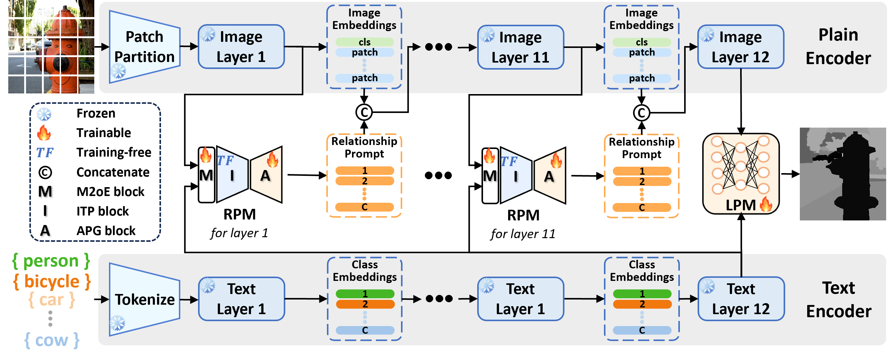

# Relationship Prompt Learning is Enough for Open-Vocabulary Semantic Segmentation

Authors: Jiahao Li, Yang Lu, Yuan Xie, Yanyun Qu*.     *Corresponding author

[[paper](https://proceedings.neurips.cc/paper_files/paper/2024/hash/8773cdaf02c5af3528e05f1cee816129-Abstract-Conference.html)] 

---

> **Abstract:** *Open-vocabulary semantic segmentation (OVSS) aims to segment unseen classes without pixel-level labels. Current Vision-Language Model (VLM)-based methods leverage VLM's extensive knowledge to enhance additional segmentation-specific networks, yielding competitive results, but at the cost of extensive parameter consumption. To reduce these costs, we attempt to enable VLM to directly produce the segmentation results without segmentation-specific networks. Prompt learning offers a direct and parameter-efficient approach. Therefore, we propose relationship prompt module (RPM), which generates relationship prompt that directs VLM to extract pixel-level semantic embeddings suitable for OVSS. Moreover, RPM integrates with VLM to construct relationship prompt network (RPN), achieving OVSS without segmentation-specific networks. RPN attains state-of-the-art performance with merely about 3M trainable parameters (2% of total parameters).* 
>
> <p align="center">
> 
> </p>

## News
* **2024-08** :loudspeaker: Our work, [RPN](https://proceedings.neurips.cc/paper_files/paper/2024/file/8773cdaf02c5af3528e05f1cee816129-Paper-Conference.pdf), has been accepted by NeurIPS 2024.
* **2024-05** :rocket: We release the code for RPN. 

## Environment:

- Install pytorch

 `conda install pytorch==1.10.1 torchvision==0.11.2 torchaudio=0.10.1 cudatoolkit=10.2 -c pytorch`

- Install the mmsegmentation library and some required packages.

 `pip install mmcv-full==1.4.4 mmsegmentation==0.24.0`
 `pip install scipy timm==0.3.2`


## Training:

 ```shell
 sh train.sh
 ```

## Inference:
 ```shell
 sh test.sh
 ```


 ## Related Assets \& Acknowledgement

Our work is closely related to the following assets that inspire our implementation. We gratefully thank the authors. 

 - CLIP:  https://github.com/openai/CLIP
 - CAT-Seg: https://github.com/cvlab-kaist/CAT-Seg
 - MaskCLIP: https://github.com/chongzhou96/MaskCLIP

## Citation:
If you find this project useful, please consider citing:
```
@article{li2024relationship,
  title={Relationship prompt learning is enough for open-vocabulary semantic segmentation},
  author={Li, Jiahao and Lu, Yang and Xie, Yuan and Qu, Yanyun},
  journal={Advances in Neural Information Processing Systems},
  volume={37},
  pages={74298--74324},
  year={2024}
}
```
